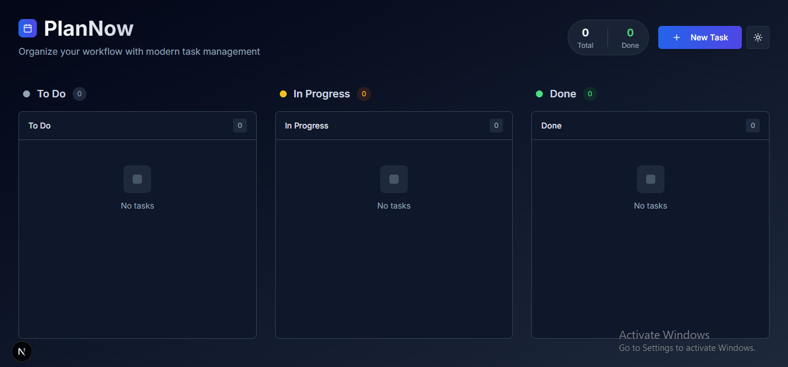

# 🚀 PlanNow - Modern Task Management



PlanNow adalah aplikasi manajemen tugas modern yang dirancang untuk membantu Anda mengorganisir workflow dengan lebih efisien. Dengan antarmuka yang intuitif dan fitur-fitur canggih, PlanNow membuat pengelolaan tugas menjadi lebih mudah dan menyenangkan.

## ✨ Fitur Utama

- 📋 **Kanban Board** - Atur tugas dengan sistem drag-and-drop yang intuitif
- 🌓 **Mode Gelap** - Dukungan tema gelap untuk kenyamanan mata
- 📱 **Responsif** - Tampilan yang optimal di semua perangkat
- 💾 **Penyimpanan Lokal** - Data tersimpan aman di browser Anda
- 🏷️ **Label Tugas** - Kategorikan tugas dengan label kustom
- ⏰ **Prioritas & Deadline** - Atur prioritas dan tenggat waktu tugas
- 🔄 **Drag & Drop** - Pindahkan tugas antar kolom dengan mudah

## 🛠️ Teknologi

- ⚛️ Next.js 14
- 🎨 Tailwind CSS
- 🔄 React DnD
- 🌈 Shadcn UI
- 📦 TypeScript

## 🚀 Memulai

1. Clone repositori
```bash
git clone https://github.com/yourusername/plannow.git
```

2. Install dependensi
```bash
cd plannow
npm install
```

3. Jalankan aplikasi
```bash
npm run dev
```

4. Buka [http://localhost:3000](http://localhost:3000) di browser Anda

## 📸 Screenshots

### Mode Terang


### Mode Gelap


## 🎯 Penggunaan

1. **Buat Tugas Baru**
   - Klik tombol "New Task"
   - Isi detail tugas
   - Atur prioritas dan deadline
   - Tambahkan label sesuai kebutuhan

2. **Atur Tugas**
   - Drag & drop tugas antar kolom
   - Edit atau hapus tugas yang ada
   - Filter tugas berdasarkan label

3. **Pantau Progress**
   - Lihat statistik tugas di header
   - Pantau tugas yang selesai
   - Kelola deadline dengan mudah

## 🤝 Kontribusi

Kontribusi selalu diterima! Silakan buat pull request atau buka issue untuk diskusi.

## 📝 Lisensi

MIT License - lihat file [LICENSE](LICENSE) untuk detail.

---

Dibuat dengan ❤️ oleh [Nama Anda]


PlanNow adalah aplikasi manajemen tugas modern yang dirancang untuk membantu Anda mengorganisir workflow dengan lebih efisien. Dengan antarmuka yang intuitif dan fitur-fitur canggih, PlanNow membuat pengelolaan tugas menjadi lebih mudah dan menyenangkan.

## ✨ Fitur Utama

- 📋 **Kanban Board** - Atur tugas dengan sistem drag-and-drop yang intuitif
- 🌓 **Mode Gelap** - Dukungan tema gelap untuk kenyamanan mata
- 📱 **Responsif** - Tampilan yang optimal di semua perangkat
- 💾 **Penyimpanan Lokal** - Data tersimpan aman di browser Anda
- 🏷️ **Label Tugas** - Kategorikan tugas dengan label kustom
- ⏰ **Prioritas & Deadline** - Atur prioritas dan tenggat waktu tugas
- 🔄 **Drag & Drop** - Pindahkan tugas antar kolom dengan mudah

## 🛠️ Teknologi

- ⚛️ Next.js 14
- 🎨 Tailwind CSS
- 🔄 React DnD
- 🌈 Shadcn UI
- 📦 TypeScript

## 🚀 Memulai

1. Clone repositori
```bash
git clone https://github.com/yourusername/plannow.git
```

2. Install dependensi
```bash
cd plannow
npm install
```

3. Jalankan aplikasi
```bash
npm run dev
```

4. Buka [http://localhost:3000](http://localhost:3000) di browser Anda

## 📸 Screenshots

### Mode Terang


### Mode Gelap


## 🎯 Penggunaan

1. **Buat Tugas Baru**
   - Klik tombol "New Task"
   - Isi detail tugas
   - Atur prioritas dan deadline
   - Tambahkan label sesuai kebutuhan

2. **Atur Tugas**
   - Drag & drop tugas antar kolom
   - Edit atau hapus tugas yang ada
   - Filter tugas berdasarkan label

3. **Pantau Progress**
   - Lihat statistik tugas di header
   - Pantau tugas yang selesai
   - Kelola deadline dengan mudah

## 🤝 Kontribusi

Kontribusi selalu diterima! Silakan buat pull request atau buka issue untuk diskusi.

## 📝 Lisensi

MIT License - lihat file [LICENSE](LICENSE) untuk detail.

---

Dibuat dengan ❤️ oleh [Availll]

Demo: https://plan-now.vercel.app/
